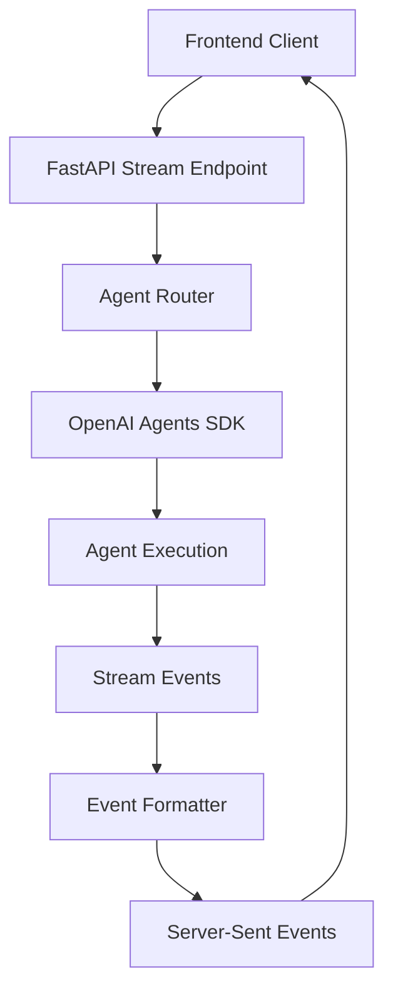

# Documentation

This directory contains comprehensive documentation for the Cogniserve AI agent system.

## Available Guides

### [Frontend Streaming Guide](./FRONTEND_STREAMING_GUIDE.md)

**Complete reference for frontend developers** implementing real-time agent streaming.

**What's covered:**
- ✅ **All event types** - Text streaming, tool execution, agent handoffs, reasoning, MCP events
- ✅ **TypeScript interfaces** - Complete type definitions for all events
- ✅ **Implementation examples** - Ready-to-use client classes and patterns
- ✅ **Framework integrations** - React hooks, Vue composables, Svelte stores, Angular services
- ✅ **UI patterns** - Typewriter effects, tool execution display, agent handoff animations
- ✅ **Error handling** - Retry logic, network resilience, user-friendly error messages
- ✅ **Performance optimization** - Memory management, debouncing, accessibility
- ✅ **Testing utilities** - Mock clients and event generators
- ✅ **Troubleshooting** - Common issues and debug helpers

**Quick start:**
```typescript
import { AgentStreamClient } from './stream-client';

const client = new AgentStreamClient();

client.onTextDelta = (delta, fullText) => {
  updateUI(fullText);
};

client.onToolCalled = (toolName, args) => {
  showToolExecution(toolName, args);
};

await client.startStream("Hello, how can you help me?");
```

## Event Types Summary

| Event Type | Purpose | Key Fields |
|------------|---------|------------|
| `raw_response` | Direct LLM events | `event_type`, `delta`, `sequence_number` |
| `run_item` | Semantic agent events | `name`, `tool_name`, `target_agent` |
| `agent_updated` | Agent handoffs | `agent_name`, `tools_count` |
| `stream_complete` | Final results | `final_output`, `usage` |
| `error` | Error handling | `message`, `timestamp` |

## Architecture



## Getting Started

1. **Backend**: Use the improved `agent_router.py` for clean event streaming
2. **Frontend**: Follow the [Frontend Streaming Guide](./FRONTEND_STREAMING_GUIDE.md)
3. **Testing**: Use mock clients for development and testing

## Support

For implementation questions or issues:
1. Check the troubleshooting section in the streaming guide
2. Review the framework-specific examples
3. Use the debug utilities for event inspection 